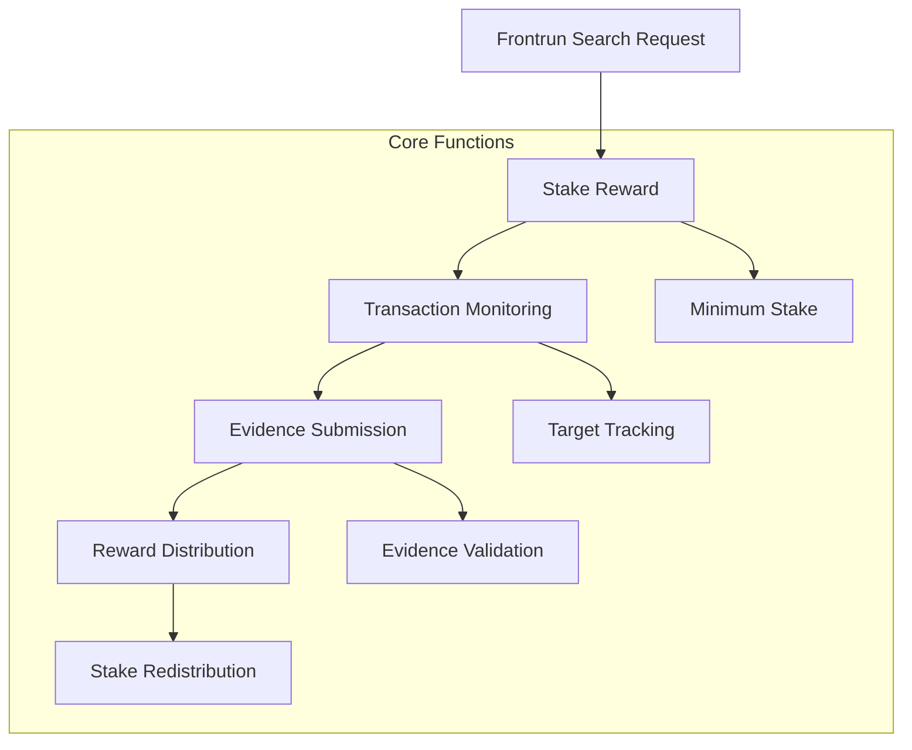

# # Frontrun Search

A decentralized marketplace for detecting and preventing blockchain transaction frontrunning, built on the Stacks blockchain.

## Overview

Frontrun Search provides a platform for blockchain users to:
- Detect and report potential transaction frontrunning
- Stake rewards for identifying frontrunning attempts
- Create and manage search requests for suspicious transactions
- Incentivize fair and transparent blockchain interactions

## Architecture



## Key Components

1. **Search Request Management**
   - Create frontrun search requests
   - Set target addresses and contracts
   - Stake rewards for detection

2. **Reporting Mechanism**
   - Submit evidence of frontrunning
   - Validate and process reports
   - Redistribute stakes based on evidence

3. **User Limits**
   - Cap on concurrent active searches
   - Minimum stake requirements
   - Transparent search status tracking

## Getting Started

### Prerequisites
- Clarinet CLI
- Stacks wallet
- STX tokens for stakes and transactions

### Installation
1. Clone the repository
2. Install dependencies with Clarinet
3. Deploy contract to chosen network

### Basic Usage

1. **Create a Frontrun Search**
```clarity
(contract-call? 
  .frontrun-search 
  create-frontrun-search
  "STX_ADDRESS" 
  "CONTRACT_NAME" 
  "Suspicious transaction detection" 
  u5000000 ;; 5 STX stake
)
```

2. **Report Frontrunning**
```clarity
(contract-call? 
  .frontrun-search 
  report-frontrun-search
  u1 ;; search-id
  "Detailed evidence of frontrunning attempt"
)
```

3. **Cancel Search**
```clarity
(contract-call? 
  .frontrun-search 
  cancel-frontrun-search 
  u1 ;; search-id
)
```

## Function Reference

### Public Functions
- `create-frontrun-search`: Initiate a new search request
- `report-frontrun-search`: Submit frontrunning evidence
- `cancel-frontrun-search`: Withdraw an active search request

### Read-Only Functions
- `get-search`: Retrieve search details
- `get-user-active-search-count`: Check user's active searches

## Development

### Testing
Run tests using Clarinet:
```bash
clarinet test
```

### Local Development
1. Start Clarinet console
```bash
clarinet console
```
2. Deploy contract
3. Interact using contract calls

## Security Considerations

- Requires STX for stakes and transactions
- Limited concurrent searches per user
- Minimum stake prevents spam
- Transparent reward mechanism

## Limitations
- Relies on community reporting
- Evidence validation is manual
- Limited to Stacks blockchain

## Contributing
Contributions welcome! Please read our contributing guidelines.

## License
[MIT License]